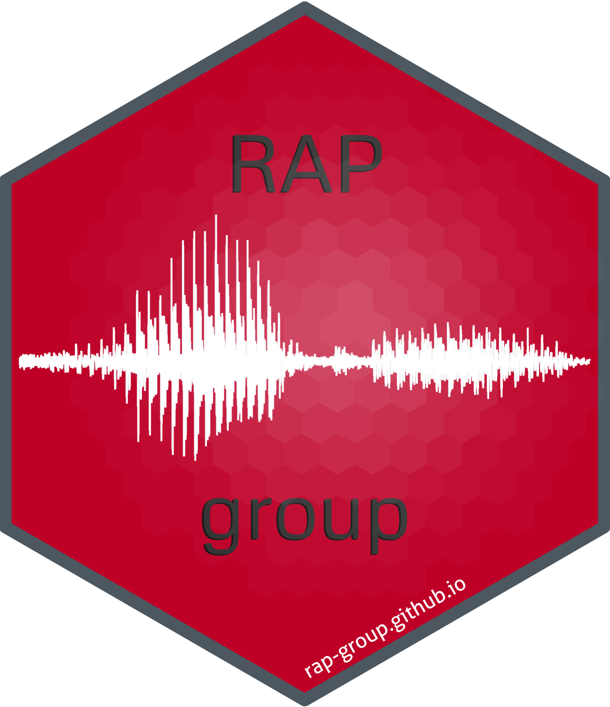

## hex-stickers

A repo for my hex stickers. You can find all the [code used to create
the hex logos](./scripts) as well as the [PNGs](./stickers). This repo
was forked from
[mkearney/hex-stickers](https://github.com/mkearney/hex-stickers), but
has changed a lot.

## To print

<https://www.stickermule.com/uses/hexagon-stickers>
